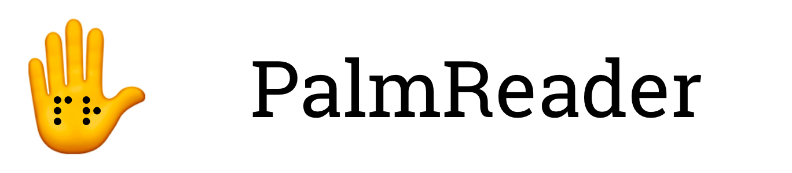

<h1 align="center">
  
   
</h1>

## Description
`PalmReader` is a wearable device that converts detected text to tactile Braille.

Won 1st Place at [Pulse Hardware Hackathon 2020](https://pulse.ece.illinois.edu/).
